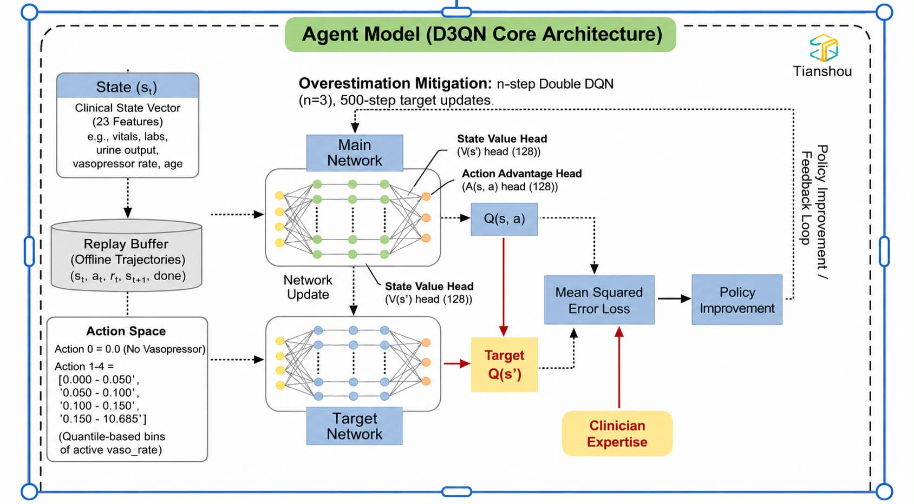

# D3QN-RL for ICU Vasopressor & Diuretic Withdrawal

A Reinforcement Learning framework (Dueling Double Deep Q-Network) designed to optimize the timing of vasopressor and diuretic withdrawal in Cardiogenic Shock patients using MIMIC-IV time-series data.



## 📌 Project Resources

| Resource | Description |
| :--- | :--- |
| **📘 Metadata & Preprocessing** | [**Google Sheet**](https://docs.google.com/spreadsheets/d/1LSfqmZLcSP8xHPAAfjYn03AENQFw4fwu/edit?gid=228105358)<br>Detailed log of variable definitions, unit conversions, and preprocessing steps. |
| **📊 Thesis Progress Report** | [**Google Slides**](https://docs.google.com/presentation/d/1U09t7jKxZ8UsAnwgkDNlwsjB7o_TckVKAzBYZJCz3jQ/edit?usp=sharing)<br>Detailed methodology, literature review, and current results. |

---

## 📂 Repository Structure

The repository is organized into three main stages: **Cohort Selection**, **Data Extraction (DML)**, and **Statistical Analysis**.

```text
cardiogenic-shock-RL/
│
├── README.md                      # Project documentation
├── Preprocessing_Metadata_Summary.md
├── RL_Repo.py                     # Main Reinforcement Learning entry point (WIP)
│
├── cohort_selection/              # Cohort filtering and definitions
│   ├── Cohort3_new.py             # Final cohort logic (Shock + >24h stay)
│   ├── Cohort_4_treatment_new.py  # Treatment specific filtering
│   ├── Criteria_met.py            # Clinical criteria validation
│   ├── Hour_Grid_1.py             # Time-series grid generation
│   ├── Helper.py                  # Cohort-specific helpers
│   └── imputation_table/          # Imputation logs and tables
│
├── data_exploration/              # SQL/DuckDB Extraction & Feature Engineering
│   ├── 0_plot.py                  # Exploratory plotting
│   ├── 2_data_definition.py       # Base data schemas
│   ├── 2_4_*_dml_*.py             # Data Manipulation Language (DML) scripts:
│   │   ├── ..._vitalsign.py       # Heart rate, BP extraction
│   │   ├── ..._vasopressor.py     # Norepinephrine/Dopamine input events
│   │   ├── ..._urine_output.py    # Hourly urine output processing
│   │   └── ..._cardiac_markers.py # Troponin, BNP extraction
│   ├── 4_6_master_dataset.py      # Final Hourly Master Table generation
│   └── 6_1_forwardfilling.py      # LOCF Imputation logic
│
├── Stastistics/                   # Visualization & Reporting
│   ├── fig/                       # Generated Figures (Flowcharts, Imputation tables)
│   └── py_draw/                   # Python scripts for drawing charts
│       ├── flow_chart_v2.py       # PRISMA cohort flow generation
│       └── criteria_met.py        # Clinical criteria visualization
│
├── Helper_function/               # Shared Utilities
│   └── clinical_helper.py         # OOP classes for ClinicalDataManager
│
└── Mermaid_code/                  # Source code for flowchart diagrams
    ├── cohort_1
    └── cohort_2
```

## 🚀 Getting Started
---
1. Prerequisites
Python 3.9+

DuckDB (for local MIMIC-IV querying)

MIMIC-IV v2.2 raw CSV files (Stored locally, referenced in base_path)

2. Pipeline Execution Order
To reproduce the cohort and dataset:

Cohort Selection: Run cohort_selection/Cohort3_new.py to identify the study population (Cardiogenic Shock > 24h).

Data Extraction: Run scripts in data_exploration/ starting with 2_4_*.py to extract clinical concepts (Labs, Vitals, Meds).

Hourly Grid & Imputation: Run Hour_Grid_1.py and 6_1_forwardfilling.py to generate the RL-ready time-series tensors.

Statistics: Use Stastistics/py_draw/ to generate Table 1 and Cohort Flowcharts.

## 🤖 Reinforcement Learning (D3QN)
---
Status: In Development

The RL module (RL_Repo.py) implements a Dueling Double Deep Q-Network to handle the continuous state space of ICU patients.

State Space: 76 variables (Vitals, Labs, Ventilation status).

Action Space: Discrete discretization of Vasopressor and Diuretic dosage adjustments.

Reward Function: Composite reward based on Survival (Terminal) and Hemodynamic Stability (Intermediate).
